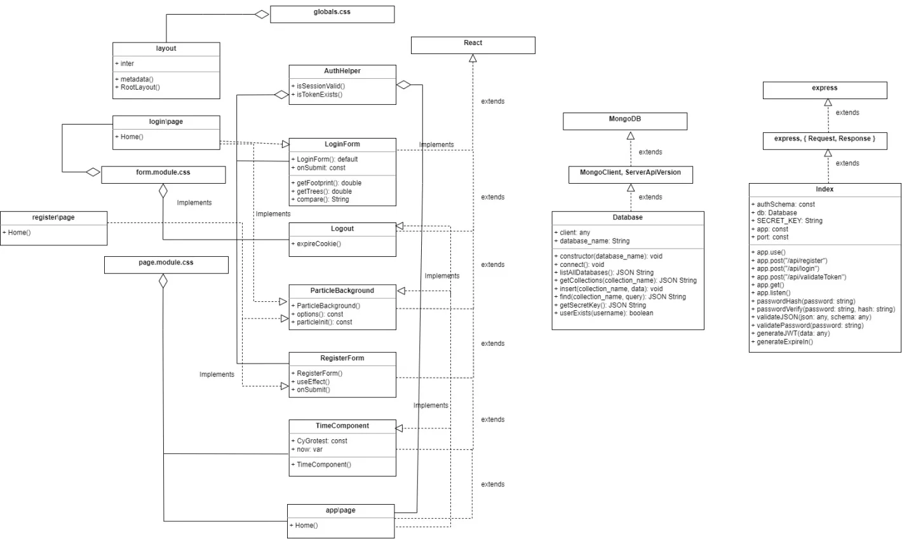

# Clean Timer Report

1. [Introduction/Background](#introductionbackground)
   - [Overview](#overview)
   - [Project Scope](#project-scope)
   - [Project Management Approach](#project-management-approach)

2. [Literature Review](#literature-review)
   - [Pomodoro Technique](#pomodoro-technique)
   - [Ultradian Rhythm](#ultradian-rhythm)
   - [Gamification of Learning](#gamification-of-learning)

3. [Software Technologies](#software-technologies)
   - [Technologies Used](#technologies-used)
   - [Technology Justification](#technology-justification)

4. [Project Lifecycle](#project-lifecycle)
   - [Analyzing Requirements](#analyzing-requirements)
   - [Designing and Setting Up](#designing-and-setting-up)
   - [Developing the Skeleton Layout](#developing-the-skeleton-layout)
   - [Implementing Minimal Marketable Features (MMFs)](#implementing-minimal-marketable-features-mmfs)
   - [Testing](#testing)
   - [Requirements](#requirements)
      - [Identifying Requirements](#identifying-requirements)
      - [Functional Requirements](#functional-requirements)
      - [Non-Functional Requirements](#non-functional-requirements)
      - [Minimal Marketable Features (MMFs)](#minimal-marketable-features-mmfs)
      - [Prioritizing Requirements](#prioritizing-requirements)

5. [Design](#design)
   - [Architecture](#architecture)
   - [Key Interactions](#key-interactions)
   - [Design Patterns](#design-patterns)
   - [Design Diagrams](#design-diagrams)

6. [Testing](#testing)
   - [Test Plan Overview](#test-plan-overview)
   - [Test Strategy](#test-strategy)
   - [Detailed Test Cases and Outcomes](#detailed-test-cases-and-outcomes)
      - [Database Tests](#database-tests)
      - [Timer Component Tests (Front-end)](#timer-component-tests-front-end)
      - [Catching Edge Cases](#catching-edge-cases)

## Introduction/Background

### Overview
CleanTimer is a study productivity application tailored for students, designed to enhance time management and study habits. It offers a user-centric dark-mode UI, customizable fonts, and a unique class/task selection utility. By gamifying learning and suggesting relaxing activities during breaks, CleanTimer aims to make study sessions more productive and engaging.

### Project Scope
CleanTimer is a web-based application with modern technologies and frameworks to deliver a seamless user experience. The scope includes front-end development with NextJS, back-end services using Bun, and database management with MongoDB.

### Project Management Approach
 For a flexible application like CleanTimer, we chose agile methodologies, allowing for iterative development, continuous integration, and regular feedback incorporation. 

---

## Literature Review

### Pomodoro Technique
The Pomodoro Technique, introduced by Francesco Cirillo in the late 1980s, is a time management method that uses a timer to break work in intervals of 25 minutes with short breaks. CleanTimer aligns with this methodology by using an algorithm to seperate shorter tasks with 5 minute breaks as suggested by the Pomodoro Technique. 

**References:**
1. Cirillo, F. (2006). "The Pomodoro Technique." Cirillo Company.
2. Bregman, P. (2007). "How to Stay Focused: Train Your Brain." Harvard Business Review.

### Ultradian Rhythm
The Ultradian Rhythm is a biological cycle observed in human sleep patterns and brain activities in a period shorter than 24 hours. Studies on Ultradian Rhythms suggest that the human brain can only focus effectively for 90-120 minutes before needing a break. CleanTimer's break suggestion algorithm schedules breaks between longer tasks, encouraging users to align with these natural rhythms, which in effect promotes better mental health and productivity.

**References:**
3. Kleitman, N. (1963). "Sleep and Wakefulness." University of Chicago Press.

## Gamification of Learning
Gamification is a proven method for motivating students to achieve goals and maintain focus. CleanTimer incorporates elements of gamification to make the studying experience engaging and rewarding for users. By turning study sessions into a game, CleanTimer encourages students to stay committed to their tasks.

- **Point System:** CleanTimer implements a scoring system that tracks a user's study habits. Users earn points for completing study sessions without interruptions and meeting their study goals. These points provide a sense of accomplishment and competitiveness for users.

- **Competition:** CleanTimer's point system allows users to compare their study performance with peer and motivate users to improve their study habits.

Gamification in CleanTimer aligns with research on motivation and productivity in education. Gamification takes advantage of intrinsic motivators such as achievement, autonomy, and competence, making the learning process more enjoyable and effective for students.

**References:**
4. Dicheva, D. (2014). "Gamification in Education: A Systematic Mapping Study." Winston Salem State University.

## Software Technologies 

### Technologies Used
- **Front-end:** NextJS for dynamic UI development.
- **Back-end:** Bun toolkit for efficient JavaScript/TypeScript application development.
- **Database:** MongoDB, a flexible NoSQL database.
- **Testing:** Jest framework for comprehensive testing.
- **Deployment:** Google Cloud Platform (GCP) for scalability and reliability.
- **CI/CD:** Docker for streamlining the development pipeline.

### Technology Justification
For our younger audience, students (in the age range of 12-24), our team decided to use novel technologies with modern features, community support, and compatibility with our project requirements, ensuring a robust and scalable application.

## Project Lifecycle

### Analyzing Requirements
Our team followed an agile approach. We began our project by thoroughly analyzing the requirements for CleanTimer. Given our target audience of students, we identified key features such as a login system, timer, task scheduler, scoring system, and break activities. Our team drew inspiration from the Pomodoro Technique and the concept of gamification to enhance study habits.

### Designing and Setting Up
After the requirements phase, we moved on to the design and setup stage. Here, we created mockups of the user interface using Figma. Simultaneously, we set up the essential infrastructure for our project. This included configuring our Continuous Integration/Continuous Deployment (CI/CD) pipeline, establishing the backend using Bun, and developing the frontend with NextJS.

### Developing the Skeleton Layout
With the infrastructure in place, we began developing the skeleton layout of the application's pages, paying attention to both functionality and aesthetics. This included designing the background elements and ensuring a user-centric dark-mode UI, in line with our vision for CleanTimer.

### Implementing Minimal Marketable Features (MMFs)
Our development process focused on implementing the Minimal Marketable Features (MMFs) that were crucial to the core functionality of CleanTimer. 

In the first sprint after requirements/setup, we focused on implementing the timer because the other key features depended on it. We iteratively improved it by refining the button styles and exploring ways to integrate it with the task scheduler.

In the next sprint, once the Timer was successfully implemented, we proceeded to develop the Task Scheduler. Again, this feature had to be closely integrated with the Timer.

In the fourth sprint we worked on the Scoring System because it was designed to work in conjunction with the Timer and Task Scheduler. We also implemented Break Activities in the fourth sprint by treating breaks as special tasks inserted by our algorithm during scheduled breaks.

### Testing
Throughout the development process, we adhered to a comprehensive testing strategy. This included unit testing for individual components, integration testing to ensure seamless functionality between components and features, system testing to assess the overall application, and both blackbox and whitebox testing for functional and non-functional aspects. Testing each feature after implementation ensured the reliability and stability of CleanTimer.

## Requirements:
### Identifying Requirements:
Because CleanTimer is built for students, it was very easy for our team to empathize with our target user. We wanted an application to track our routine, so including a scheduler and a timer were the first things that came to our mind. Because some of our team took psychology classes for our intelligence thread, we thought of the Pomodoro Technique and conducted some research on incoprorating break periods to increase focus and productivity. After thinking more about retaining users, our team thought of ways to "Gamify" the learning experience which is how we came up with the score system.

### Functional Requirements:
#### 1. Register/Login with Account
- **Function:** Users should be able to create an account and log in to access CleanTimer's features.
- **Implementation:** User registration and authentication mechanisms with MongoDB.
- **User Benefit:** Provides access to personalized study sessions and progress tracking.

#### 2. Timer
- **Function:** The Timer should accurately measure and display the remaining time for focused study sessions.
- **Implementation:** Placeholder (details to be implemented).
- **User Benefit:** Gives users a sense of direct control over their time, enhancing productivity.

#### 3. Task Scheduler
- **Function:** Users should be able to schedule and manage their study tasks and allocate time slots for study sessions.
- **Implementation:** Integrated with the "Timer" feature for synchronized task management.
- **User Benefit:** Aids in better organization of study time, enhancing focus and efficiency.

#### 4. Scoring System
- **Function:** The Scoring System should track and reward study sessions based on user activity and adherence to breaks.
- **Implementation:** Points are earned or deducted based on study habits and adherence to schedules.
- **User Benefit:** Quantifies user study habits, motivating continuous and consistent focused study through gamification.

#### 5. Break Activities
- **Function:** During scheduled breaks, CleanTimer should offer a variety of relaxing activities.
- **Implementation:** Treated as a task but randomly generated; activates "break mode."
- **User Benefit:** Encourages healthy study habits by balancing focused study with enjoyable breaks.

### Non-Functional Requirements:
#### 1. Scalability
- **Requirement:** CleanTimer should handle varying user loads.
- **Implementation:** Use scalable cloud infrastructure on Google Cloud Platform (GCP).
- **User Benefit:** Ensures consistent performance even with a growing user base.

#### 2. Reliability
- **Requirement:** The application should consistently perform tasks without unexpected failures.
- **Implementation:** Robust error handling and thorough testing.
- **User Benefit:** Users can rely on CleanTimer for their study sessions without interruptions.

#### 3. Security
- **Requirement:** User data and accounts should be protected from unauthorized access and data breaches.
- **Implementation:** Strong encryption, secure authentication mechanisms, and regular security audits.
- **User Benefit:** Ensures the safety and privacy of user information.

### Minimal Marketable Features (MMFs):
1. **Timer Functionality:** Accurate timing for study sessions is crucial for the core functionality of CleanTimer.

2. **Task Scheduler:** Integrated task management is essential for users to effectively plan their study sessions.

3. **Scoring System:** The scoring system is integral to gamifying the study experience and motivating users to stay consistent.

4. **Break Activities:** Providing users with a variety of relaxing activities during scheduled breaks to promote healthy study habits.

### Prioritizing Requirements:
1. **Timer and Task Scheduler:** These were core features that directly contributed to CleanTimer's primary goal of helping users manage their study time effectively so implementing these features was a top priority.

2. **Scoring System and Break Activities:** While these features enhance user engagement and motivation, they depend on the Timer and Task Scheduler functionalities. Therefore, they should be implemented after the core features.

3. **Register/Login with Account:** While essential for user access, this can be considered a foundational feature that can be developed in parallel with the core functionalities.

## Design

### Architecture
CleanTimer uses a 3-layered architecture to ensure modularity and maintainability:

1. **Front-end Layer:** This layer is responsible for the user interface and user interactions. It communicates with the backend layer to fetch and display data, manage user schedules and tasks, and provide an intuitive user experience. We implemented the front-end using NextJS, leveraging its capabilities for dynamic UI development.

2. **Backend Layer:** The backend layer serves as the bridge between the front-end and the data store. It manages user schedules and tasks, as well as the synchronization of data with the data store. The backend strictly communicates with MongoDB, using efficient and secure database operations. Notably, we implemented the Singleton Pattern for the database connection, ensuring that only one instance of the database is maintained throughout the program's execution.

3. **Datastore Layer:** MongoDB serves as the data store, housing user-related information, schedules, and tasks. Its flexibility as a NoSQL database complements CleanTimer's requirements for scalability and data management.

### Key Interactions
The primary interactions within CleanTimer's architecture revolve around the management of user schedules and tasks:

- **Front-end to Backend:** The front-end layer communicates user schedules and tasks to the backend layer, initiating actions such as creating new study sessions, scheduling breaks, and updating task lists.

- **Backend to Datastore:** The backend layer interacts with MongoDB to store and retrieve a user's schedule and login information.

### Design Patterns

#### Singleton Pattern
The Singleton Pattern is applied to the database connection in CleanTimer. It ensures that only one instance of the "database" exists throughout the program's lifecycle. This design pattern enhances resource management and prevents unnecessary overhead by reusing the same database connection across multiple requests and operations.

#### Observer Pattern
The Observer Pattern is used in CleanTimer for handling authentication and break management:

- **Authentication:** A session validator observes user authentication, listening for token expiration. This design pattern allows for real-time validation of user sessions and enhances security by automatically handling token expiration events.

- **BreakManager:** BreakManager observes the timer component, listening for break tasks. When a break is scheduled, the BreakManager triggers the display of relaxing activities, contributing to the gamification aspect of CleanTimer.

### Design Diagrams
Here is the class diagram of CleanTimer

## Testing

### Test Plan Overview
The test plan for CleanTimer is designed to ensure the application's functionality and performance meet our high standards. Our primary focus is on testing the key features of CleanTimer, including authentication processes, the timer's accuracy, the calculation of points, and the variety of break activities. The testing is structured to align with the functional and non-functional requirements of CleanTimer.

### Test Strategy
Our testing strategy is structured to cover various aspects of the application, using a combination of different testing methodologies:

#### Testing Process
- **Unit Testing:** Individual component testing, focusing on the front-end components, the timer's accuracy, score tracking system, and the random break activities.
- **Integration Testing:** Using a bottom-up approach, we will integrate the timer with the scoring system and break activities.
- **System Testing:** Testing the entire application as a whole to ensure that all functional requirements are met.
- **Non-Functional Testing:** Simple unit tests to check against non-functional requirements like response time and efficiency.

#### Technology
We will use Jest for both front-end and back-end testing, which offers snapshot testing for UI components and code coverage analysis tools. This will be integrated with our CI/CD pipelines for streamlined testing processes.

### Detailed Test Cases and Outcomes

#### Database Tests

1. **getCollections() Test**
   - **Action:** Retrieve all data from a specified collection.
   - **Expected Result:** Returns 'mocked data'.
   - **Outcome:** Successfully retrieved 'mocked data'. The test validated the `getCollections` method's functionality.

2. **insert() Test**
   - **Action:** Insert a document into a collection.
   - **Expected Result:** Document insertion without errors.
   - **Outcome:** Document inserted successfully. This test confirmed the `insert` method's operational integrity.

3. **find() Test**
   - **Action:** Find a document in a collection.
   - **Expected Result:** Returns 'found data'.
   - **Outcome:** Successfully retrieved 'found data'. The test verified the `find` method's accuracy in locating documents.

4. **userExists() Test**
   - **Action:** Check if a user exists in the database.
   - **Expected Result:** Returns `true` for an existing user.
   - **Outcome:** Correctly identified the existence of the user, validating the `userExists` method.

#### Timer Component Tests (Front-end)

1. **Default Time Render Test**
   - **Action:** Render TimerComponent with default initial time.
   - **Expected Result:** Displays '40:00'.
   - **Outcome:** Correctly displayed '40:00', confirming the default timing functionality.

2. **Custom Initial Time Test**
   - **Action:** Render TimerComponent with a custom initial time of 30 minutes.
   - **Expected Result:** Displays '30:00'.
   - **Outcome:** Accurately displayed '30:00', ensuring the component's customizability.

3. **Countdown Test**
   - **Action:** Render TimerComponent and advance time by 1 second.
   - **Expected Result:** Countdown from '01:00' to '00:59'.
   - **Outcome:** Correctly counted down, validating the timer's second-by-second countdown accuracy.

4. **Zero Reach Test**
   - **Action:** Render TimerComponent and advance time to complete the countdown.
   - **Expected Result:** Countdown reaches '00:00'.
   - **Outcome:** Successfully reached '00:00', confirming the timer's ability to complete a countdown cycle.

5. **Interval Cleanup Test**
   - **Action:** Unmount TimerComponent.
   - **Expected Result:** Cleans up interval to prevent memory leaks.
   - **Outcome:** Interval was cleared, as indicated by the called `clearIntervalSpy`, ensuring resource efficiency and leak prevention.

6. **Timer Reset on Prop Change Test**
   - **Action:** Change the `initialMinutes` prop and re-render the TimerComponent.
   - **Expected Result:** Resets timer according to the new initial time.
   - **Outcome:** Timer reset correctly to '02:00' upon prop change, proving the component's dynamic response to prop updates.

7. **No Update After Zero Test**
   - **Action:** Render TimerComponent, advance time to zero, and then advance an additional second.
   - **Expected Result:** Timer stays at '00:00' after reaching zero.
   - **Outcome:** Correctly remained on '00:00', ensuring the timer does not go beyond its intended limit.

Our team recognized from the beginnning that having a reliable timer was paramount to the application's core functionality, and it was imperative to get it right from the start.

#### Catching Edge Cases

One of the key learnings was the importance of catching edge cases with the timer with scenarios such as:

- Starting the timer with custom initial times.
- Checking if the timer accurately counted down each second.
- Verifying that the timer correctly reached '00:00' and stopped.
- Ensuring the timer did not go into negative times or exhibit unexpected behavior.

By catching edge cases, we ensured that users would have a reliable tool for managing their study sessions right from the beginning and that we could safely develop the scheduler and point systems. We learned early on how important it was to have a good foundation for the timer feature so we could avoid extensive debugging with score and break errors.
